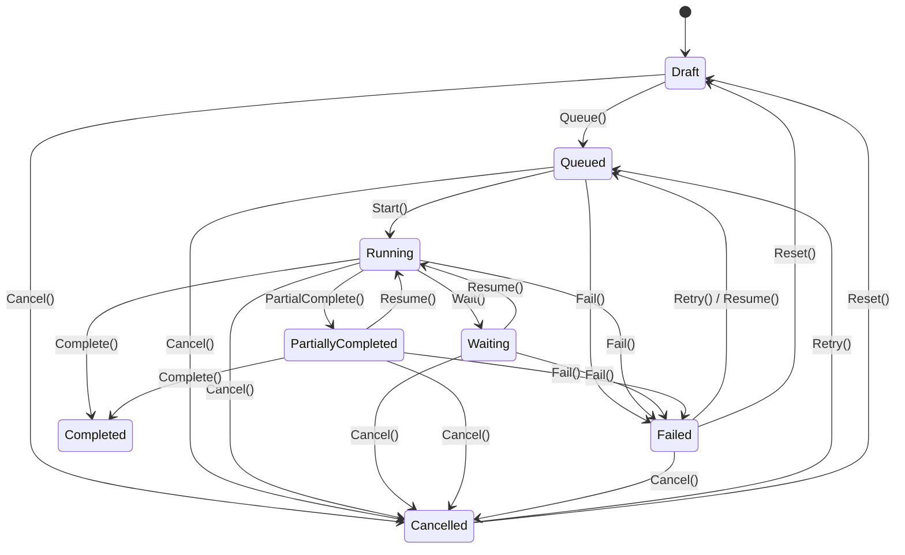
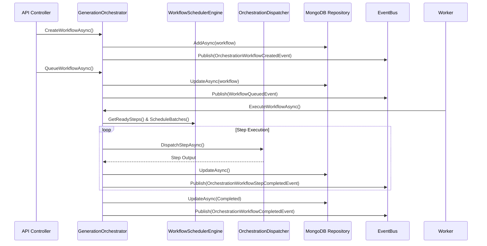
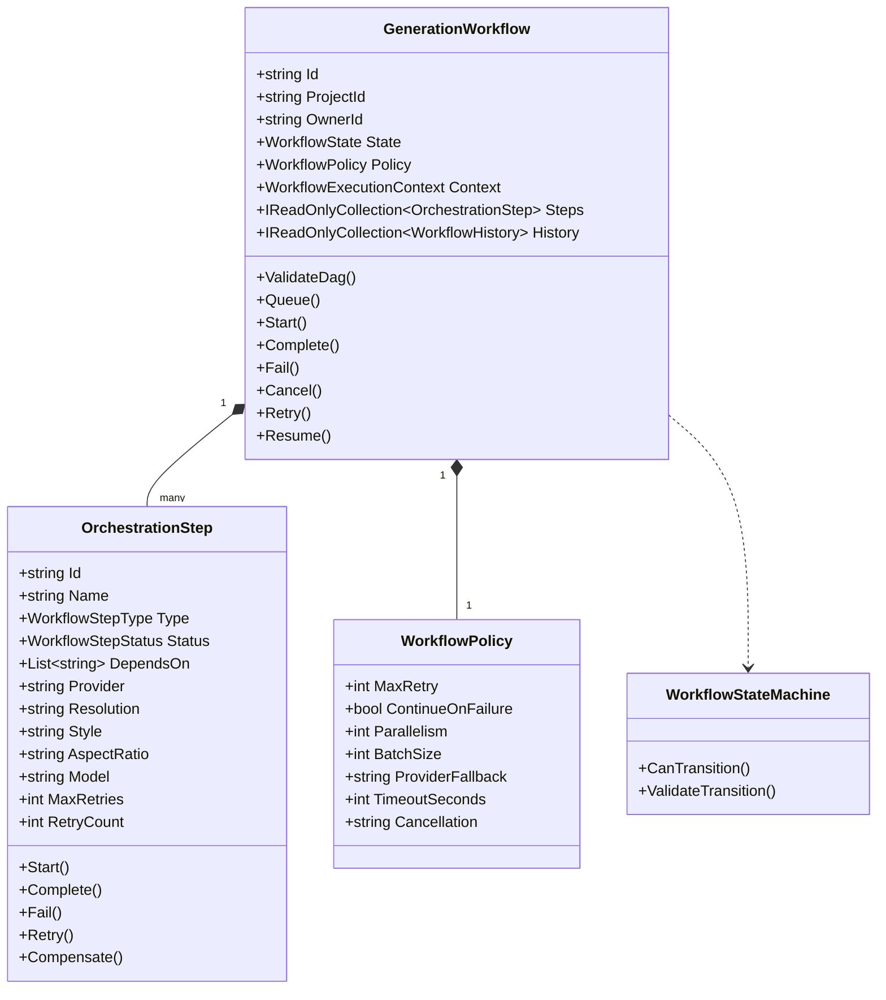

# AI Generation Orchestration Engine

## Architecture Overview
The AI Generation Orchestration Engine is a dedicated Event-Driven orchestration layer responsible for managing the complete lifecycle of AI video generation workflows. 
Crucially, the Orchestration Engine **does not directly generate AI content, does not render, and does not invoke AI providers directly**. Instead, it coordinates scene/shot partitioning, DAG dependency resolution, parallel execution, batch scheduling, retry orchestration, cancellation, compensation, and domain event publishing through the existing Render Engine, Provider Framework, Event Bus, and Persistence layer.

```
Workflow -> Scene -> Shot -> Generation Task -> RenderJob -> Provider -> Completed
```

---

## State Machine
The workflow transitions strictly through controlled states managed by `WorkflowStateMachine`:



---

## Execution Flow & Sequence Diagram
1. **Creation**: `GenerationWorkflow.Create()` builds the aggregate root and validates the graph using `ValidateDag()`. Domain event `OrchestrationWorkflowCreatedEvent` is raised.
2. **Queueing**: `QueueWorkflowAsync()` transitions the state to `Queued` and publishes `WorkflowQueuedEvent`.
3. **Worker Polling**: `GenerationWorkflowWorker` polls `generation_workflows` for `Queued` state items.
4. **Execution & Scheduling**:
   - `WorkflowSchedulerEngine` analyzes the DAG, identifies ready steps, groups parallel steps (e.g. Scene 1 -> Shot A, Shot B, Shot C concurrently), and batches shots by matching attributes (`Provider`, `Resolution`, `Style`, `AspectRatio`, `Model`) up to `WorkflowPolicy.BatchSize`.
   - `OrchestrationDispatcher` dispatches steps/batches through `IWorkflowStepDispatcher`.
5. **Retry & Compensation Strategy**:
   - Step failure attempts retry up to `MaxRetries`.
   - If configured, switches to `ProviderFallback`.
   - On retry exhaustion, executes compensation (`ExecuteCompensationAsync`), rolling back resources or cancelling downstream steps.
   - Respects `Policy.ContinueOnFailure` to allow partial execution.



---

## Class Diagram



---

## Persistence & Metrics
- **MongoDB Collections**: `generation_workflows`, `workflow_steps`, `workflow_histories`.
- **Health Check**: `WorkflowOrchestratorHealthCheck` inspecting queue depth and engine status.
- **OpenTelemetry Metrics**:
  - `workflow_started_total`
  - `workflow_completed_total`
  - `workflow_failed_total`
  - `workflow_duration_seconds`
  - `workflow_parallel_steps_total`
  - `workflow_batch_total`
  - `workflow_retry_total`
